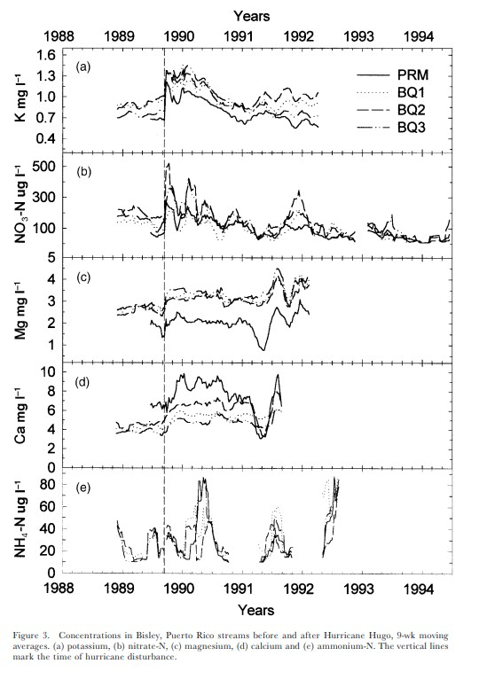

# Ion concentrations in Bisley, Puerto Rico streams before and after Hurricane Hugo

This repository contains the clean data and code necessary to replicate Figure 3 from Schaefer et al. ([2000](https://doi.org/10.1017/s0266467400001358)). The data for the analysis were retrieved through the [Environmental Data Initiative](https://doi.org/10.1017/s0266467400001358). Data cleaning and analysis were conducted using R version 4.6.1 and require tidyverse package installation.

## Data
The raw data can be found in the data/ directory. To reproduce the clean data used for analysis, run 1_clean_data.R to create a csv of moving averages for all four stream site housed in the output/ directory.

## Analysis
The function used to calculate the 9-week moving average of each ion at a given site is defined in R/moving-average.R. After combining the data for plotting in 1_clean_data.R, the figure was recreated in paper/paper.qmd and rendered to the docs/ directory. Previous drafts of the analysis are housed in the scratch/ directory. 

## Source
**Author:** Sarah Busby  
**Date Created:** August 24th, 2025

## References
McDowell, William H., and USDA Forest Service. International Institute Of Tropical Forestry (IITF). 2024. “Chemistry of Stream Water from the Luquillo Mountains.” Environmental Data Initiative. https://doi.org/10.6073/PASTA/F31349BEBDC304F758718F4798D25458.

Schaefer, Douglas. A., William H. McDowell, Fredrick N. Scatena, and Clyde E. Asbury. 2000. “Effects of Hurricane Disturbance on Stream Water Concentrations and Fluxes in Eight Tropical Forest Watersheds of the Luquillo Experimental Forest, Puerto Rico.” Journal of Tropical Ecology 16 (2): 189–207. https://doi.org/10.1017/s0266467400001358.
